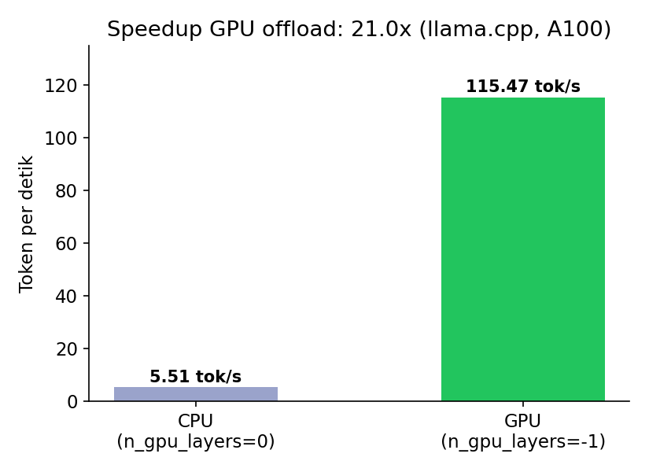
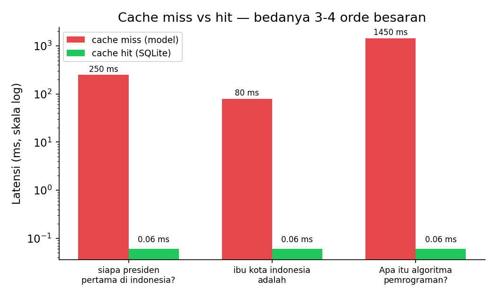

# GGUF Serving + SQL Response Cache (llama.cpp)

Menyajikan model hasil fine-tuning dalam format GGUF lewat [llama.cpp](https://github.com/ggml-org/llama.cpp), dengan lapisan cache di depannya, plus demonstrasi sengaja soal risiko utama caching output LLM: jawaban yang salah, begitu tersimpan di cache, akan tetap salah sampai ada hal lain (bukan cache-nya) yang diubah.

Notebook ini dirancang berpasangan dengan **[llama3-qlora-finetuning](https://github.com/arielshakaramiro/llama3-qlora-finetuning)** — dia memuat file GGUF hasil ekspor repo tersebut. Kalau file itu tidak ditemukan di Google Drive, otomatis fallback ke model publik di Hugging Face.

Semua angka di bawah berasal dari run nyata di Google Colab (GPU: NVIDIA A100-SXM4-40GB). Tidak ada angka yang diestimasi.

## Yang dikerjakan

1. Memasang `llama-cpp-python` yang dikompilasi dengan dukungan CUDA sesuai GPU yang terdeteksi.
2. Memuat model GGUF — dari hasil ekspor repo satunya di Drive, atau fallback Hugging Face.
3. Membandingkan kecepatan prompt yang sama di CPU saja vs GPU offload penuh.
4. Membangun lapisan cache dengan kunci hash SHA-256 dari instruksi, input, tag model, dan parameter decoding — jadi mengubah salah satunya otomatis membuat entri lama tidak berlaku. Backend: SQLite (default) atau MySQL (kredensial lewat Colab Secrets, tidak pernah di-hardcode).
5. Mengukur latensi cache-miss vs cache-hit pada prompt yang sama.
6. Menjalankan uji kecil reasoning urutan ("siapa presiden ke-N di Konoha", dari daftar yang diberikan) dengan kunci jawaban yang bisa dicek terprogram, lalu mendemonstrasikan apa yang terjadi kalau jawaban salah ikut tersimpan di cache.

## Hasil

### GPU offload

| | Token/detik |
|---|---|
| CPU (`n_gpu_layers=0`) | 5,51 |
| GPU (`n_gpu_layers=-1`) | 115,47 |
| **Speedup** | **21,0x** |



### Latensi cache

| Prompt | Cache miss (model) | Cache hit (SQLite) |
|---|---|---|
| "siapa presiden pertama di indonesia?" | 250 ms | 0,06 ms |
| "ibu kota indonesia adalah" | 80 ms | 0,06 ms |
| "Apa itu algoritma pemrograman?" | 1.450 ms | 0,06 ms |



Bedanya 3–4 orde besaran, dan itu wajar: cache hit adalah pencarian primary-key di SQLite, cache miss adalah satu proses generate penuh.

### Risiko yang tidak dilindungi oleh cache

Uji reasoning urutan mendapat skor **60% (3/5)**. Dua jawaban yang salah sama-sama mengikuti pola yang sama — modelnya mengulang nama yang **benar untuk urutan sebelumnya**, bukan maju ke nama berikutnya (ditanya presiden ke-3, dijawab dengan nama presiden ke-2; ditanya ke-5, dijawab dengan nama ke-4).

Memakai salah satu jawaban salah itu, notebook lalu menunjukkan risiko sesungguhnya: model dipanggil sekali (jawaban salah), jawaban salah yang sama disajikan dari cache di panggilan kedua, entri cache-nya dihapus, dan panggilan ketiga **menghasilkan jawaban salah yang identik lagi** — karena decoding-nya greedy dan deterministik. Menghapus entri cache yang salah tidak memperbaiki jawaban yang salah secara struktural; yang memperbaiki cuma mengubah prompt, data, atau modelnya.

## Cara menjalankan

1. Buka `notebooks/llama_cpp_gguf_serving_cache.ipynb` di Google Colab.
2. Set runtime ke GPU.
3. Jalankan semua sel dari atas ke bawah. `llama-cpp-python` dikompilasi dari source dengan flag CUDA sesuai GPU yang terdeteksi — langkah ini bisa memakan beberapa menit.
4. Untuk pakai MySQL alih-alih SQLite default, set `USE_MYSQL = True` dan isi `MYSQL_HOST` / `MYSQL_PORT` / `MYSQL_USER` / `MYSQL_PASSWORD` / `MYSQL_DB` di Colab Secrets (atau masukkan manual saat diminta).

## Struktur repo

```
.
├── notebooks/
│   └── llama_cpp_gguf_serving_cache.ipynb
├── images/
│   ├── cpu_vs_gpu.png
│   └── cache_latency.png
├── LICENSE
└── README.md
```

## Keterbatasan

- Cache-nya exact-match: dua pertanyaan dengan makna sama tapi redaksi beda dianggap tidak berhubungan dan sama-sama kena ke model. Cache semantik butuh embedding dan ambang batas kemiripan.
- Cache tidak punya cara menilai kebenaran — jawaban salah yang selesai generate dengan wajar tetap tersimpan sama seperti jawaban benar.
- Caching cuma masuk akal dengan decoding deterministik (greedy). Kalau sampling diaktifkan, prompt yang identik bisa sah-sah saja menghasilkan jawaban berbeda, dan cache akan membekukan satu varian secara sembarang.
- Angka benchmark adalah pengukuran satu kali dalam satu sesi Colab; throughput GPU khususnya bisa bervariasi antar run.

## Lisensi

MIT — lihat [LICENSE](LICENSE).
